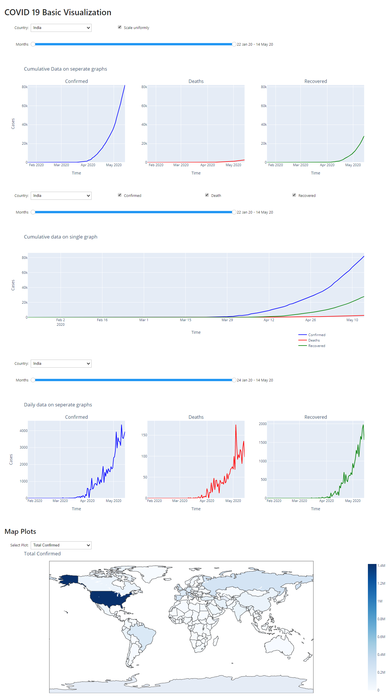

# COVID-19
A Personal COVID-19 Dashboard. Deployed here:
https://covid19-dashborad.herokuapp.com/

Just an attempt to visualize COVID-19 data with the following learning objectives:
- Explore ````covid-19```` data
- Use ````plotly```` with ````python````
- To build and deploy ````jupyter notebooks```` uing ````Voila````

### Current features
- Cumulative data plots for confirmed, dead and recovered cases
- Daily data plots for confirmed, dead and recovered cases
- Latest data vizualized on Maps

### Data
Novel Coronavirus (COVID-19) Cases, provided by JHU CSSE
- https://github.com/CSSEGISandData/COVID-19

### Usage (at your local machine)
* Clone this repository
* Browse the cloned location
* Install dependencies: ````pip install -r requirements.txt````
* Run the [````grab_data.py````](grab_data.py) script to download [data](data).
* Use [````i_notebook.ipynb````](i_notebook.ipynb) or [````i_notebook_resposive.ipynb````](i_notebook_resposive.ipynb)
* For deploying locally:
  - Non-Responsive: ````voila i_notebook.ipynb````

### Screenshot


### Notes
This project was created and tested under Windows, and is expected to work fully in other systems too.

This project is still under development. Parts of the source codes may not be well documented.
Also suitable prompts may not be available for the user at the moment.

More features and fixes are yet to come. Meanwhile suggestions, ideas, bug reports are welcomed.

I am a python n00bie! I am still learning python! I have tried my best to give in as much effort required (of course directly proportionate to my knowledge), for this project.

<br>***Kinjal Raykarmakar***
